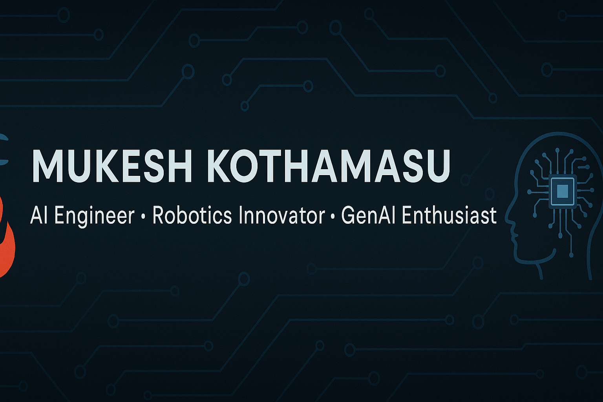

<!-- README.md for Mukesh Kothamasu -->

  

<h1 align="center">Hi there 👋, I'm Mukesh Kothamasu</h1>

  

  
  
  
  

---

## 🧑‍💼 About Me

- 🎓 CSE (AI & ML), CMR College of Engineering & Technology  
- 🔥 Fire safety innovator with AI-based robotic suppression system  
- 🤖 Enthusiastic about Generative AI, Deep Learning, and real-world applications  
- 💡 Finalist at national-level hackathons & ideathons  
- ⚡ 400+ DSA challenges solved  

---

## 💻 Tech Stack

| Category | Tools & Frameworks |
|---------|--------------------|
| 🔤 Languages | Python, C++, Java, C |
| 🧠 AI/ML | TensorFlow, PyTorch, Keras, YOLO, OpenCV |
| 🧰 Libraries | Pandas, NumPy, Scikit-learn, Matplotlib, Seaborn |
| 🌐 Web | HTML, CSS, React.js, Streamlit, Gradio |
| 🛢️ Databases | MySQL |
| 🤖 GenAI | HuggingFace, Langchain, CrewAI, Ollama, Whisper |
| 🔧 Tools | Git, GitHub, Google Colab, VS Code |

---

## 🚀 Highlight Projects

### 🔥 [Nirva-Agni Fire Suppression System](https://drive.google.com/file/d/1yOMNr_Gk29MEsFfSpiub4UtGtdnM0vHe/view?usp=sharing)
- 🔍 Real-time fire detection using YOLO + OpenCV  
- 🦾 Two-axis robotic arm for foam-layered fire suppression  
- ⚙️ Tech: Python, IoT, Servo Motors, TensorFlow  

### 📊 [Data Cleaning & Visualization](https://github.com/K-Mukesh-1209/automated_data_cleaning_and_Visualization)
- 📈 Streamlit-based data preprocessing & correlation visualizer  
- 🧪 Feature importance analysis with 95% accuracy  
- 🛠 Tech: Pandas, Seaborn, Scikit-learn  

### 🩺 [AI Doctor Voice Chatbot](https://github.com/K-Mukesh-1209/AI_Doctor_Voice_Chatbot)
- 🗣️ Multimodal chatbot using Groq + Whisper  
- 🎧 Accepts both audio and image input  
- ⏱ Response in <1.5s | Tested on 500+ cases  

---

## 🏆 Achievements

🏅 3rd Place – **PROMETHAN Ideathon**, BVRIT  
🥉 3rd Prize – **VISAI Project Expo**, Vel Tech  
💰 ₹50,000 Grant – **iCreate SparkUp Grant**  
🚀 Finalist – **Transfer of Tech Conf**, Punjab Univ  
🥈 2nd Place – **CMR Hackfest**  
♻️ Finalist – **IMPULSE Social Summit**  
📈 400+ Problems Solved – LeetCode, Codeforces, GFG

---

## 📚 Certifications

| Title | Platform |
|-------|----------|
| [Machine Learning](https://www.coursera.org/account/accomplishments/certificate/VZ2W5WSCURJJ) | Coursera |
| [CNNs](https://www.coursera.org/account/accomplishments/certificate/P916DF5K1RWY) | Coursera |
| [Sequence Models](https://www.coursera.org/account/accomplishments/certificate/YN591MVXLPBF) | Coursera |
| [Hyperparameter Tuning](https://www.coursera.org/account/accomplishments/certificate/RP764UNJ38TD) | Coursera |

---

## 🎯 Extracurriculars

- 🎖️ NCC Cadet (2023–2025), 3 leadership camps  
- 🥈 Kabaddi Team – Inter-college runner-up  
- 🥋 Karate – Orange Belt, Silver Medalist (AP State)

---

## 📈 Visitor Count

  

---

## 🤝 Let’s Collaborate!

If you’re into AI, robotics, GenAI, or data visualization — let’s team up!  
📬 Feel free to reach out at: **mukeshkothamasu12@gmail.com**

---

> _“Code with Purpose. Build with Impact.”_ 🚀
